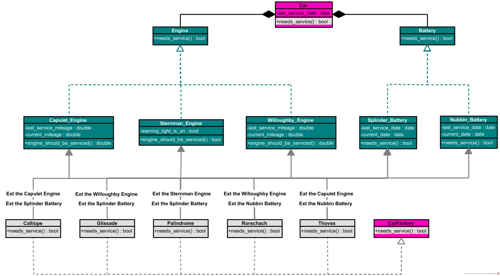

<body>

    <a href="https://www.theforage.com/">
        <picture> 
            <source media="(prefers-color-scheme: dark)" srcset="forage_logo.png">
            <source media="(prefers-color-scheme: light)" srcset="forage_logo.png">
            
        </picture>
    </a>

 
</body>

---

# Michael's Virtual Experience With Lyft

During this virtual experience, I learned how to:

- produced a clean design for a messy component of a software architecture using Python and UML
- refactored the software architecture using the "Factory Method" and "Strategy" patterns
- wrote various unit tests for the architecture's newly refactored system using Python
- added new functionality to the architecture's system using the TDD (Test-Driven Development) methodology

---

# A UML Exemplary Diagram

    One of my UML diagrams of the software's architecture.  

