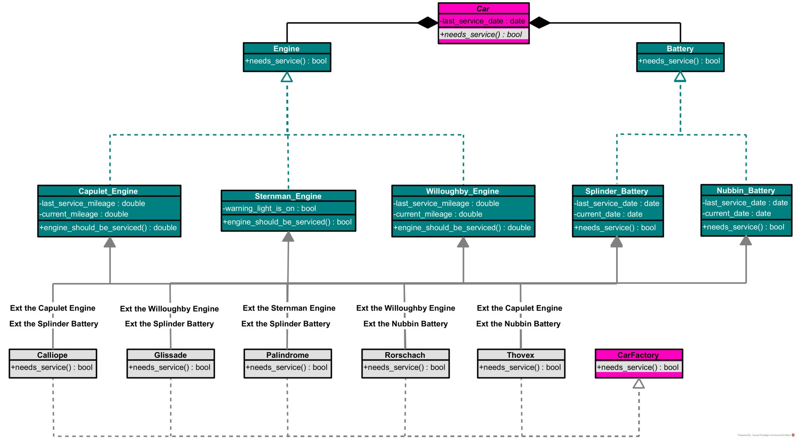

<html lang="en">
  <body>
    

      <a href="https://help.lyft.com/hc/e/all/articles/115012926707-Use-of-the-Lyft-Logo-and-Brand">
        <picture>  
          <source media="(prefers-color-scheme: dark)" srcset="images/lyft_logo.png">
          
        </picture>
      </a>
    

  </body>
</html>

## My Virtual Experience With Lyft

During this virtual experience provided by Forage and sponsored by Lyft, I learned how to:

- produced a clean design for a messy component of a software architecture using Python and UML
- refactored the software architecture using the "Factory Method" and "Strategy" patterns
- wrote various unit tests for the architecture's newly refactored system using Python
- added new functionality to the architecture's system using the TDD (Test-Driven Development)
  methodology

## A Unified Modeling Language (UML) Exemplary Diagram

This unified modeling language (UML) diagram showcases my attempted redesign of the project's
software architecture.

